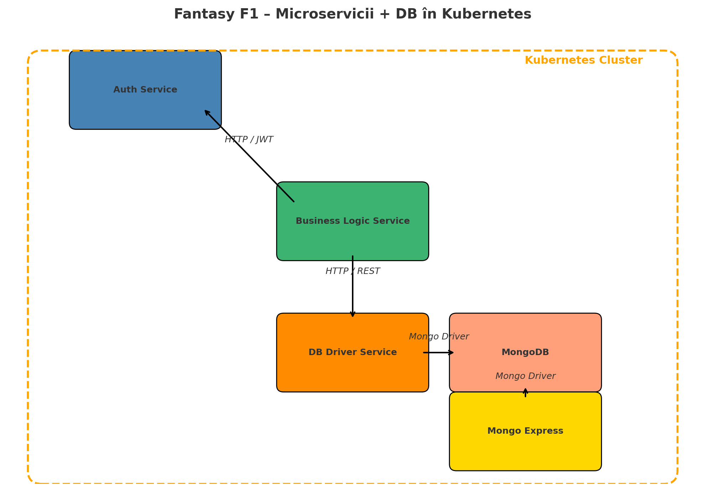

# Fantasy Formula 1 - Microservices Project

## Membrii echipei

- Nume: Rusei Nicolae-Andrei
  Grupa: 343C1

- Nume: Ștefan Darius
  Grupa: 343C1

## Asistent responsabil

- Nume: Teia Vava
## Descriere tematică și funcționalități

Aplicația *Fantasy Formula 1* este un joc virtual de tip fantasy în care utilizatorii își creează echipe proprii formate din piloți și o echipă reală de Formula 1, respectând un buget prestabilit. După fiecare cursă, utilizatorii primesc puncte în funcție de performanțele reale ale piloților și echipelor selectate. Scopul jocului este acumularea celui mai mare punctaj pe parcursul sezonului virtual.

Funcționalitățile aplicației includ:
- Autentificare și înregistrare a utilizatorilor cu gestionare JWT.
- Crearea echipelor fantasy pentru fiecare cursă (2 piloți + 1 echipă).
- Validarea selecțiilor: unicitate, încadrări în buget, restricții per cursă.
- Calcularea punctajelor în funcție de rezultatele reale (sursă simulată).
- Salvarea echipelor și a scorurilor per utilizator.
- Generarea unui clasament global.
- Interfață administrativă pentru baza de date, expusă prin Mongo Express.

Aplicația este gândită pentru orchestrare într-un cluster Kubernetes și se bazează pe microservicii separate, care comunică prin protocoale REST, utilizând JWT pentru securizare.

## Diagramă arhitectură

## Descrierea componentelor și tehnologiilor

### Auth Service
Responsabil cu înregistrarea, autentificarea și generarea token-urilor JWT. Este un serviciu REST scris în Spring Boot. Accesul la resursele sensibile este securizat prin token-uri JWT validate la fiecare request.

### Business Logic Service
Este componenta principală a aplicației. Se ocupă cu primirea și validarea echipelor fantasy, procesarea scorurilor și logica de joc. Comunică cu Auth Service pentru verificarea token-urilor și cu DB Driver Service pentru salvarea datelor. Este implementat tot în Spring Boot.

### DB Driver Service
Este o interfață REST intermediară între Business Logic și baza de date MongoDB. Expune operații CRUD pentru toate entitățile (utilizatori, piloți, echipe, curse, scoruri). Este responsabil și de popularea inițială a bazei de date.

### MongoDB & Mongo Express
MongoDB este folosit ca bază de date NoSQL pentru persistența aplicației. Mongo Express este o interfață web care permite accesul administrativ la date, utilă pentru debugging și vizualizare rapidă.

### Conectivitate
- Serviciile comunică între ele prin HTTP/REST.
- JWT este transmis între servicii pentru autorizare.
- DB Driver folosește un client de Mongo pentru interacțiunea cu baza de date.
- Toate serviciile sunt containerizate și orchestrate cu Kubernetes, fiecare având propriul `Deployment` și `Service`.

## Responsabilitățile membrilor echipei

- **Rusei Nicolae-Andrei**: Implementarea Auth Service și integrarea cu Business Logic Service. Configurarea Kubernetes pentru orchestrare.

- **Ștefan Darius**: Implementarea Business Logic Service și DB Driver Service. Configurarea MongoDB și Mongo Express pentru administrare.

## Repos Links
- [Main App](https://github.com/ABGS-IDP/FantasyF1)
- [DB Connector](https://github.com/ABGS-IDP/FantasyF1-DBAPI)
- [Auth Service](https://github.com/ABGS-IDP/FantasyF1-Auth)
